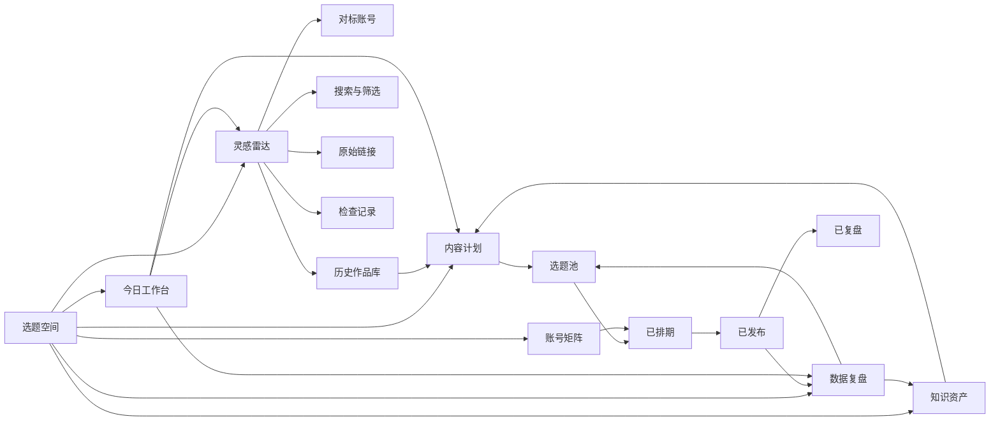
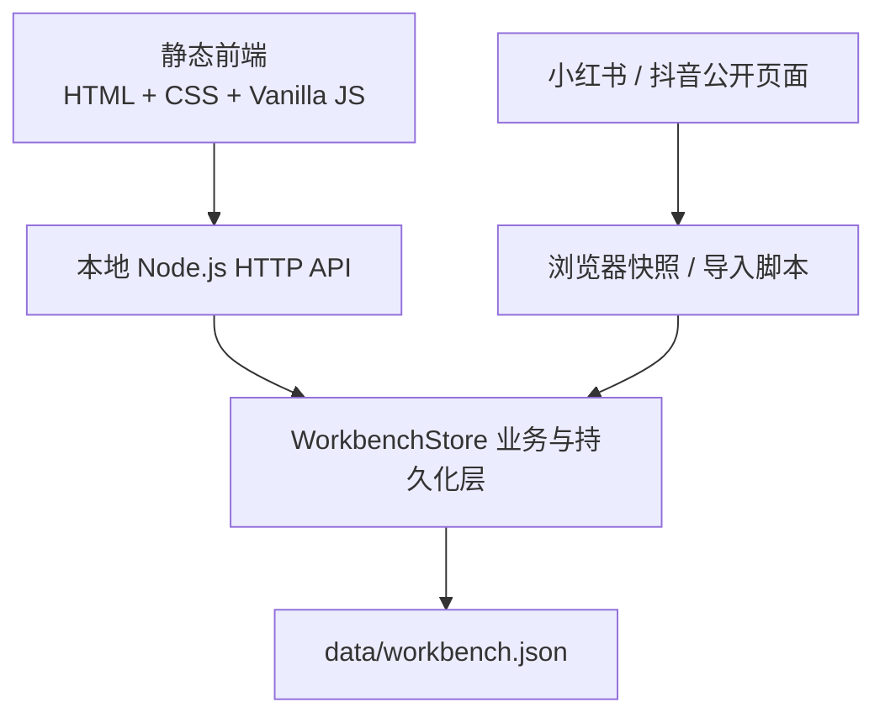
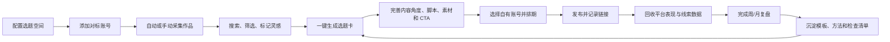

# 自媒体运营创作工作台 PRD

> 文档类型：现状版 PRD / 功能架构说明 / 用户流程评审  
> 产品名称：拼好家运营创作中心  
> 评审日期：2026-08-03  
> 当前版本：MVP 0.1.0  
> 运行形态：本地单机 Web 工作台  
> 文档依据：当前代码、页面、接口、数据文件及自动化测试

---

## 1. 文档目的

本文档用于回答四个核心问题：

1. 当前系统已经具备哪些功能。
2. 每个功能模块及其子模块分别解决什么问题。
3. 用户应该按照什么路径使用整个工作台。
4. 当前流程是否已经满足“自媒体日常运营闭环”的需求，还缺少什么。

本文档严格区分：

- **真实可用**：已接入本地数据，操作后能产生真实查询或写入结果。
- **部分可用**：部分环节真实可用，但仍依赖脚本、接口或人工操作。
- **原型展示**：界面和交互可以查看，但数据为固定示例，不会持久化。
- **规划能力**：已有数据结构或产品位置，但尚未形成用户可操作功能。

---

## 2. 产品定位

### 2.1 一句话定位

一个将“外部灵感采集、内部内容计划、多平台账号运营、发布后复盘、方法沉淀”集中在一起的本地自媒体运营工作台。

### 2.2 当前核心价值

当前版本最实际的价值是：

- 集中保存对标创作者在不同平台的公开作品。
- 按平台、创作者、标题和标签快速检索历史内容。
- 保留账号主页和作品原始链接，方便回到平台核对。
- 用“选题空间”隔离不同内容方向，避免资料混杂。
- 为后续内容计划、账号矩阵、数据复盘和知识库提供统一产品框架。

### 2.3 目标用户

- 自媒体账号负责人。
- 内容策划、编导和运营人员。
- 同时运营小红书、抖音、视频号等平台的小团队。
- 需要长期跟踪对标账号、积累选题和复盘方法的个人创作者。

### 2.4 当前产品边界

当前系统是本地单机 MVP，不是完整的多成员 SaaS：

- 无登录、成员、角色和权限系统。
- 无云端同步和多设备协作。
- 不直接发布内容到第三方平台。
- 不绕过平台登录、验证码或反自动化限制。
- “刷新雷达”目前只记录一次本地检查，不会实时抓取平台新作品。

---

## 3. 当前系统快照

截至 2026-08-03，系统内已有：

| 数据项 | 当前数量/状态 |
|---|---:|
| 选题空间 | 3 个 |
| 已启用选题空间 | 1 个：家居 |
| 待配置选题空间 | 2 个：方向二、方向三 |
| 参考创作者 | 1 位：居里富人 |
| 对标平台账号 | 2 个：小红书、抖音 |
| 已收录公开作品 | 137 条 |
| 小红书作品 | 14 条，部分收录 |
| 抖音作品 | 123 条，标记为完整收录 |
| 已记录同步任务 | 3 次 |
| 作品时间范围 | 2024-01-29 至 2026-08-01 |

### 3.1 功能成熟度总览

| 一级模块 | 当前成熟度 | 是否使用真实数据 | 当前结论 |
|---|---|---|---|
| 今日工作台 | 部分可用 | 部分 | 对标数据真实，任务、排期、目标和待复盘内容为示例 |
| 内容计划 | 原型展示 | 否 | 可查看策划卡，不能新增、编辑、拖动或保存 |
| 灵感雷达 | 真实可用 | 是 | 当前最完整的业务模块 |
| 账号矩阵 | 原型展示 | 否 | 展示了账号定位框架，不能维护真实自有账号 |
| 数据复盘 | 原型展示 | 否 | 指标和结论为固定示例 |
| 知识资产 | 原型展示 | 否 | 只有资产卡片和提示，没有真实文档内容 |
| 选题空间 | 部分可用 | 是 | 数据结构支持多个空间，目前只有“家居”可进入 |
| 数据写入接口 | 部分可用 | 是 | 支持新增对标账号、手动补充作品，但页面没有入口 |

---

## 4. 总体功能架构

### 4.1 产品设计逻辑

整个工作台采用“一个运营闭环、多个独立选题空间”的结构：

1. **灵感雷达**负责外部输入。
2. **内容计划**负责把灵感变成可执行内容。
3. **账号矩阵**负责决定内容在哪个平台、以什么定位发布。
4. **数据复盘**负责判断内容和转化是否有效。
5. **知识资产**负责沉淀可复用的方法。
6. **今日工作台**负责把上述模块中最重要的动作集中到每天。

这个架构方向是合理的，问题不在模块划分，而在于目前只有“外部输入”形成了真实数据能力，其余环节尚未完成数据闭环。

---

## 5. 功能模块详细说明

### 5.1 全局框架与选题空间

**模块作用：** 为不同内容方向提供独立的数据和运营上下文。

| 子模块 | 作用 | 当前状态 |
|---|---|---|
| 主导航 | 在今日工作台、内容计划、灵感雷达、账号矩阵、数据复盘、知识资产之间切换 | 真实可用 |
| 选题空间导航 | 切换不同内容方向，隔离创作者、账号和作品数据 | 部分可用 |
| 空间状态 | 区分“运行中”和“待配置” | 真实可用 |
| 本地运行提示 | 明确数据只保存在当前设备 | 真实可用 |
| 移动端导航 | 小屏幕下将左侧导航转换为顶部横向导航 | 真实可用 |

当前只有“家居”空间为运行中；“方向二”和“方向三”不可进入，也没有在页面中创建或配置空间的入口。

---

### 5.2 今日工作台

**模块作用：** 汇总当天最重要的运营动作，减少用户在不同模块之间来回寻找任务。

| 子模块 | 作用 | 数据属性 | 当前状态 |
|---|---|---|---|
| 今日优先级 | 告诉用户今天最应该推进的内容事项 | 固定示例 | 原型展示 |
| 推进清单 | 按优先级展示今日任务和截止时间 | 固定示例 | 原型展示 |
| 本周节奏 | 展示选题、脚本、发布、复盘的周节奏 | 固定示例 | 原型展示 |
| 运营摘要 | 汇总对标作品、账号、待发布内容和线索目标 | 前两项真实，后两项示例 | 部分可用 |
| 待复盘队列 | 提醒已发布内容补充数据和输出结论 | 固定示例 | 原型展示 |
| 最新灵感信号 | 展示当前空间最新 3 条对标作品 | 本地真实数据 | 真实可用 |
| 刷新雷达 | 发起一次检查并显示结果提示 | 只记录检查，不采集新内容 | 部分可用 |
| 快捷跳转 | 从首页进入内容计划、灵感雷达或数据复盘 | 真实导航 | 真实可用 |

**当前限制：**

- 今日任务不能新增、完成、延期或重新排序。
- 周计划和日期文案是固定内容，不会随当前日期自动变化。
- 例如页面固定显示“本周第 31 周”，但评审日 2026-08-03 已进入第 32 周。
- “本周待发布”“本月线索目标”不是系统计算结果。
- 待复盘内容不来自真实发布记录。

---

### 5.3 内容计划

**模块作用：** 把灵感推进为可发布、可复盘的内容任务。

#### 5.3.1 状态看板

| 子模块 | 业务含义 | 当前状态 |
|---|---|---|
| 选题池 | 保存尚未排期的内容想法 | 原型展示 |
| 已排期 | 保存已确定平台、形式和发布时间的内容 | 原型展示 |
| 已发布 | 标记已经上线、等待数据回收的内容 | 原型展示 |
| 已复盘 | 标记已经完成表现分析和经验沉淀的内容 | 原型展示 |

#### 5.3.2 内容策划卡

点击示例卡片后，可查看：

- 内容标题。
- 目标平台。
- 当前状态。
- 业务目标，如获客、增长、种草、转化。
- 内容角度。
- 转化动作 CTA。
- 本次创作重点。

**当前限制：**

- 不能新增、编辑、删除或复制内容卡。
- 不能拖动卡片改变状态。
- 不能关联灵感雷达中的对标作品。
- 不能保存脚本、素材、负责人、发布时间或发布链接。
- 所有卡片和详情均写死在前端代码中。

---

### 5.4 灵感雷达

**模块作用：** 建立长期可检索的对标内容资料库，是当前版本的核心真实能力。

#### 5.4.1 历史作品

| 子模块 | 作用 | 当前状态 |
|---|---|---|
| 作品列表 | 按发布时间倒序查看当前空间的历史作品 | 真实可用 |
| 平台筛选 | 查看全部、小红书、抖音或手动收录内容 | 真实可用 |
| 创作者筛选 | 按参考创作者过滤作品 | 真实可用 |
| 关键词搜索 | 在标题和标签中搜索关键词 | 真实可用 |
| 结果计数 | 显示当前筛选结果数量 | 真实可用 |
| 标签展示 | 展示每条作品最多 3 个标签 | 真实可用 |
| 可见互动数 | 展示采集时可见的互动数字段 | 部分可用 |
| 原作品跳转 | 在新窗口打开平台原始作品 | 真实可用 |
| 发布时间推导 | 根据小红书或抖音作品 ID 推导发布时间 | 真实可用 |

#### 5.4.2 对标账号

| 子模块 | 作用 | 当前状态 |
|---|---|---|
| 创作者归属 | 一个创作者可以绑定多个平台账号 | 真实可用 |
| 平台信息 | 展示账号所属平台 | 真实可用 |
| 账号 ID | 展示平台账号标识 | 真实可用 |
| 主页链接 | 保留并打开原账号主页 | 真实可用 |
| 收录进度 | 展示已收录数量和完整/待核对状态 | 真实可用 |
| 采集模式 | 区分快照、浏览器全历史等来源 | 数据层可用 |

#### 5.4.3 检查与同步

点击“刷新雷达”后，系统会：

1. 读取当前空间中的账号数量。
2. 生成一条新的同步记录。
3. 记录开始时间、结束时间、检查账号数和执行模式。
4. 返回成功提示。

它目前**不会访问小红书或抖音，也不会发现和导入新作品**。真实采集仍需通过浏览器采集或导入脚本完成。

#### 5.4.4 数据写入能力

后端已经支持：

- 新增参考账号。
- 手动新增作品。
- 批量导入或更新作品。
- 按“平台 + 平台作品 ID”去重。
- 记录最近 100 次同步任务。

但新增账号和手动新增作品目前没有前端表单，普通用户无法在工作台页面内完成。

---

### 5.5 账号矩阵

**模块作用：** 管理自有账号的定位、内容分工、目标人群和转化目标。

| 子模块 | 作用 | 当前状态 |
|---|---|---|
| 平台账号卡 | 展示不同平台的自有账号 | 原型展示 |
| 运营状态 | 区分运营中、筹备中 | 原型展示 |
| 账号定位 | 定义账号内容价值和表达方向 | 原型展示 |
| 核心人群 | 明确每个账号服务的目标用户 | 原型展示 |
| 月度目标 | 记录咨询线索或阶段性目标 | 原型展示 |
| 核心 CTA | 规定每个平台的主要转化动作 | 原型展示 |

当前展示了小红书、抖音和视频号三个示例账号，但它们不是后端真实账号数据，不能维护或统计。

---

### 5.6 数据复盘

**模块作用：** 将内容表现、账号增长和咨询转化变成下一轮运营决策。

| 子模块 | 作用 | 当前状态 |
|---|---|---|
| 周/月周期切换 | 查看不同复盘周期 | 仅视觉展示 |
| 内容互动 | 汇总点赞、评论、收藏等互动 | 固定示例 |
| 新增关注 | 查看账号增长 | 固定示例 |
| 有效咨询 | 查看业务线索 | 固定示例 |
| 转化率 | 衡量内容到咨询的转化效率 | 固定示例 |
| Top 内容 | 找出值得继续复用的内容 | 固定示例 |
| 复盘结论 | 沉淀标题、开头和 CTA 的有效规律 | 固定示例 |
| 跳转知识资产 | 将复盘方法导向模板沉淀 | 仅导航 |

当前系统没有真实的自有内容发布记录，也没有对应的平台表现和线索数据，因此不能自动完成真实复盘。

---

### 5.7 知识资产

**模块作用：** 将稳定有效的方法沉淀为团队可重复使用的标准。

当前规划了四类资产：

| 资产类型 | 示例资产 | 作用 | 当前状态 |
|---|---|---|---|
| 品牌 | 内容表达手册 | 统一语气、禁用词、视觉原则和 CTA | 原型展示 |
| 模板 | 小红书图文脚本模板 | 规范标题、封面、痛点、方案、清单和 CTA | 原型展示 |
| 流程 | 发布前检查清单 | 减少漏项和低级错误 | 原型展示 |
| 复盘 | 周度内容复盘模板 | 统一复盘输入、结论和下周动作 | 原型展示 |

点击“查看摘要”只会提示该模块尚未接入真实知识库。

---

## 6. 底层数据与技术架构

### 6.1 技术结构

### 6.2 核心数据对象

| 数据对象 | 作用 | 关键关系 |
|---|---|---|
| Space 选题空间 | 隔离不同内容方向 | 包含创作者、账号、作品和同步记录 |
| Creator 参考创作者 | 表示一个真实对标人物或品牌 | 可绑定多个平台账号 |
| Account 平台账号 | 表示创作者在某个平台的账号 | 归属于一个创作者和一个空间 |
| Post 作品 | 保存标题、标签、指标、发布时间和原链接 | 归属于账号、创作者和空间 |
| SyncRun 同步记录 | 保存每次采集或检查结果 | 归属于一个空间 |

### 6.3 当前 API

| 方法 | 接口 | 作用 | 页面是否使用 |
|---|---|---|---|
| GET | `/api/dashboard` | 获取空间总览、计数、最新作品、账号和同步记录 | 是 |
| GET | `/api/posts` | 按空间、平台、创作者、关键词查询作品 | 是 |
| GET | `/api/accounts` | 查询空间内对标账号 | 间接使用 |
| POST | `/api/accounts` | 新增参考创作者或平台账号 | 否 |
| POST | `/api/posts` | 手动补充作品 | 否 |
| POST | `/api/sync` | 记录一次空间检查 | 是 |

### 6.4 数据可靠性

- 数据保存于 `data/workbench.json`。
- 写入时先生成临时文件，再替换正式文件，降低中断导致的数据损坏风险。
- 作品使用“平台 + 平台作品 ID”去重。
- 当前自动化测试覆盖数据筛选、去重、同步记录、首页接口、账号新增和手动作品新增。
- 当前共 6 项自动化测试，均已通过。

---

## 7. 用户使用路径

### 7.1 当前版本可执行路径

#### 路径 A：启动并查看运营总览

1. 在项目目录运行 `npm start`。
2. 打开 `http://127.0.0.1:4173`。
3. 默认进入“家居”选题空间。
4. 在今日工作台查看已监测作品数、对标账号数和最新对标作品。
5. 根据首页提示进入灵感雷达进一步研究。

#### 路径 B：研究对标内容

1. 进入“灵感雷达”。
2. 在“历史作品”中输入主题关键词。
3. 使用平台筛选缩小到小红书或抖音。
4. 使用参考人物筛选查看特定创作者。
5. 查看作品标题、标签、发布时间和可见互动数。
6. 点击原作品链接回到平台查看完整内容。
7. 在工作台外人工记录可借鉴的选题、结构或表达方法。

#### 路径 C：核对对标账号收录情况

1. 进入“灵感雷达”。
2. 切换到“对标账号”。
3. 查看账号平台、账号 ID、主页地址和收录进度。
4. 点击主页链接人工核对是否有新作品。
5. 点击“刷新雷达”记录本次检查。
6. 如发现新作品，通过导入脚本或后端接口补充，页面暂时无法直接添加。

#### 路径 D：查看内容运营框架

1. 进入“内容计划”，理解选题池到已复盘的状态流程。
2. 点击示例策划卡查看内容角度、CTA 和创作重点。
3. 进入“账号矩阵”，查看不同平台的定位分工方式。
4. 进入“数据复盘”，查看理想的周/月复盘结构。
5. 进入“知识资产”，查看后续应沉淀的资产分类。

该路径当前主要用于确认产品设计，不适合管理真实内容项目。

---

### 7.2 目标版本完整运营路径

#### 建议的日常节奏

**每天：**

1. 打开今日工作台，查看当天任务。
2. 刷新灵感雷达，处理新增对标作品。
3. 将有效信号加入选题池。
4. 推进即将发布的内容卡。
5. 为已发布内容补充阶段数据。

**每周：**

1. 周一完成选题筛选和排期。
2. 周中推进脚本、素材和审核。
3. 按账号矩阵执行发布。
4. 周末复盘 Top 内容、低效内容和线索结果。
5. 将有效规律写入知识资产，并形成下周动作。

**每月：**

1. 对比各平台账号的增长、互动和线索贡献。
2. 调整账号定位、内容比例和 CTA。
3. 清理低价值选题，扩充高价值内容系列。
4. 更新品牌表达、脚本模板和发布 SOP。

---

## 8. 当前流程是否满足需求

### 8.1 需求满足度判断

| 用户需求 | 当前满足度 | 判断 |
|---|---|---|
| 集中保存对标账号和作品 | 高 | 已满足 |
| 快速搜索历史选题和标签 | 高 | 已满足 |
| 跨平台查看同一创作者 | 高 | 已满足 |
| 保留原始来源并回到平台核对 | 高 | 已满足 |
| 自动发现对标账号新作品 | 低 | 未满足 |
| 在页面中新增账号和手动补作品 | 中低 | 后端支持，前端未提供 |
| 将灵感直接转为选题 | 低 | 未满足 |
| 管理真实内容排期和状态 | 低 | 只有原型 |
| 管理真实自有账号矩阵 | 低 | 只有原型 |
| 记录发布链接和平台表现 | 低 | 未满足 |
| 统计互动、涨粉、咨询和转化 | 低 | 只有示例 |
| 输出周/月复盘结论 | 低 | 只有示例 |
| 沉淀和调用真实知识资产 | 低 | 只有原型 |
| 管理多个内容方向 | 中低 | 数据结构支持，只有一个空间启用 |
| 多人协作和多设备使用 | 无 | 当前产品边界之外 |

### 8.2 负责人结论

**当前架构方向满足需求，但当前实现尚未满足“完整自媒体运营工作台”的使用需求。**

更准确地说：

- 如果你的核心需求是“建立一个对标账号作品资料库，并能快速检索研究”，当前版本已经基本可用。
- 如果你的核心需求是“每天在一个系统里完成灵感发现、选题、排期、发布、数据回收、复盘和方法沉淀”，当前版本还没有形成闭环。
- 当前最主要的断点不是页面数量不足，而是数据没有从灵感雷达继续流入内容计划，也没有从发布结果流入数据复盘和知识资产。

因此，接下来不应继续增加更多静态页面，而应优先打通一条真实内容从“灵感”到“复盘”的完整链路。

---

## 9. 关键问题与风险

| 优先级 | 问题 | 对用户的影响 |
|---|---|---|
| P0 | 刷新雷达不采集新作品 | 用户容易误以为系统已完成实时监控 |
| P0 | 内容计划不能保存真实数据 | 无法用系统管理日常内容生产 |
| P0 | 灵感作品不能转为选题 | 最有价值的数据与执行流程断开 |
| P0 | 无发布记录和真实复盘数据 | 无法形成运营反馈闭环 |
| P1 | 新增账号、手动作品只有接口，没有页面 | 普通用户无法独立维护资料库 |
| P1 | 自有账号矩阵为静态示例 | 无法管理真实账号定位和目标 |
| P1 | 知识资产没有正文、版本和引用能力 | 复盘结论无法真正复用 |
| P1 | 日期、任务、目标为固定示例 | 首页无法反映真实当日工作 |
| P1 | “可见互动数”含义不够明确 | 不同平台指标可能不可直接比较 |
| P2 | 无编辑、删除、归档、导出和备份入口 | 长期使用后维护成本较高 |
| P2 | 无失败状态、采集日志详情和重试机制 | 采集异常时难以排查 |
| P2 | 仅本地单机使用 | 无法支持团队协作和移动办公 |

---

## 10. 建议建设顺序

### 10.1 P0：先打通最小真实闭环

#### 功能 1：真实内容计划

- 新增、编辑、删除和归档内容卡。
- 支持选题池、已排期、制作中、待发布、已发布、已复盘状态。
- 保存平台、目标账号、内容形式、负责人、发布时间、脚本、素材、CTA 和备注。
- 支持状态拖动或明确的状态变更操作。

#### 功能 2：灵感转选题

- 在对标作品旁增加“加入选题池”。
- 自动带入来源作品、标题、平台、创作者和原始链接。
- 要求用户补充“可借鉴点”和“差异化角度”，避免简单复制。

#### 功能 3：发布与复盘记录

- 内容发布后记录平台、发布时间和作品链接。
- 手动补充播放、点赞、评论、收藏、涨粉、私信和有效线索。
- 自动计算互动率、收藏率和线索转化率。
- 将复盘结论回写到内容卡。

#### 功能 4：真实今日工作台

- 今日任务由内容计划和复盘节点自动生成。
- 展示逾期、今日发布、待补数据和待复盘事项。
- 用户可以完成、延期和调整优先级。

**P0 验收标准：** 用户可以在不修改代码和 JSON 的情况下，完成一条真实内容从对标灵感、选题、排期、发布到复盘的全过程。

### 10.2 P1：提高资料库维护效率

- 增加选题空间的创建、编辑、停用和切换。
- 增加对标创作者和平台账号管理页面。
- 增加手动作品录入表单。
- 接入受控浏览器采集器，并清晰展示采集成功、失败、验证码阻塞和新增数量。
- 增加作品收藏、标注、分类、备注和相似内容聚合。
- 将账号矩阵改为真实可维护数据。
- 将知识资产改为可编辑文档和模板库。

### 10.3 P2：规模化与协作

- 数据导入、导出和自动备份。
- 多用户、角色权限和操作日志。
- 云端同步与多设备访问。
- 平台数据自动回收或标准化导入。
- 内容日历、提醒和团队协作。
- AI 辅助选题聚类、脚本初稿、标题变体和复盘摘要。

---

## 11. 建议的产品成功指标

系统进入真实运营后，建议观察：

| 指标 | 定义 | 目标意义 |
|---|---|---|
| 灵感转选题率 | 加入选题池的灵感数 / 已标记灵感数 | 判断采集内容是否有用 |
| 选题发布率 | 已发布内容数 / 已排期内容数 | 判断计划执行能力 |
| 按时发布率 | 按计划时间发布数 / 已发布内容数 | 判断运营节奏 |
| 复盘完成率 | 已复盘内容数 / 发布满规定天数的内容数 | 判断是否形成反馈闭环 |
| 方法复用率 | 使用知识资产模板的内容数 / 总发布内容数 | 判断沉淀是否真正被使用 |
| 单条内容有效线索 | 有效咨询数 / 已发布内容数 | 判断业务转化价值 |
| 对标更新发现时效 | 新作品发布到系统发现的平均时间 | 判断雷达监控价值 |

---

## 12. 当前版本使用建议

在下一阶段功能完成前，建议把当前系统定位为“对标内容研究库”，按以下方式使用：

1. 主要使用“灵感雷达”搜索和核对对标作品。
2. 使用原作品链接完成深度阅读和拆解。
3. 暂时在外部文档维护真实内容计划、发布记录和复盘数据。
4. 不把首页的待发布数量、线索目标和复盘指标当成真实经营数据。
5. 不把“刷新雷达”理解为已经完成平台自动监控。
6. 新增账号或作品时，暂时使用导入脚本或 API，由后续版本补齐页面入口。

---

## 13. 最终评审意见

当前系统已经完成了正确的产品骨架，也形成了一个可运行、可检索、可持久化的对标内容资料库。模块命名和整体流程覆盖了自媒体运营的主要阶段，技术结构对于本地 MVP 也足够轻量。

但从实际经营结果出发，当前仍属于“资料库 + 运营工作台原型”，还不是完整的运营系统。下一阶段最重要的目标应是：

> **让一条真实内容能够从对标作品进入选题池，经过排期和发布，再带着真实数据完成复盘，并把结论沉淀为可复用资产。**

只有这条链路真正跑通，今日工作台、内容计划、账号矩阵、数据复盘和知识资产才会从并列页面变成一个持续运转的系统。
